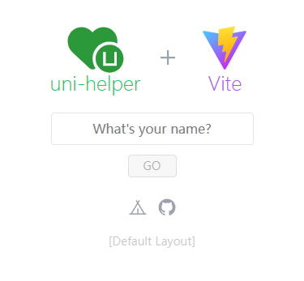

<p align="center">

</p>

<h2 align="center">
Vitesse for uni-app
</h2><br>

<pre align="center">
🧪 Working in Progress
</pre>

<p align="center">
<br>
<a href="https://vitesse-uni-app.netlify.app/">🖥 Online Preview</a>
<br><br>
<a href="https://stackblitz.com/github/uni-helper/vitesse-uni-app"></a>
</p>

## 特性

- ⚡️ [Vue 3](https://github.com/vuejs/core), [Vite](https://github.com/vitejs/vite), [pnpm](https://pnpm.io/), [esbuild](https://github.com/evanw/esbuild) - 就是快！

- 🗂 [基于文件的路由](./src/pages)

- 📦 [组件自动化加载](./src/components)

- 📑 [布局系统](./src/layouts)

- 🎨 [UnoCSS](https://github.com/unocss/unocss) - 高性能且极具灵活性的即时原子化 CSS 引擎

- 😃 [各种图标集为你所用](https://github.com/antfu/unocss/tree/main/packages/preset-icons)

- 🔥 使用 [新的 `<script setup>` 语法](https://github.com/vuejs/rfcs/pull/227)

- 📥 [API 自动加载](https://github.com/antfu/unplugin-auto-import) - 直接使用 Composition API 无需引入

- 🦾 TypeScript, 当然
<!-- eslint -->
- [ESLint](https://eslint.org/) - 保证代码质量

## 现在可以试试!

### GitHub 模板

[使用这个模板创建仓库](https://github.com/uni-helper/vitesse-uni-app/generate).

### 克隆到本地

如果您更喜欢使用更干净的 git 历史记录手动执行此操作

```bash
npx degit uni-helper/vitesse-uni-app my-vitesse-app
cd my-vitesse-app
pnpm i # 如果你没装过 pnpm, 可以先运行: npm install -g pnpm
```

## 使用

参考 uni-app 官方文档： [运行、发布 uni-app](https://uniapp.dcloud.net.cn/quickstart-cli.html#%E8%BF%90%E8%A1%8C%E3%80%81%E5%8F%91%E5%B8%83uni-app)
